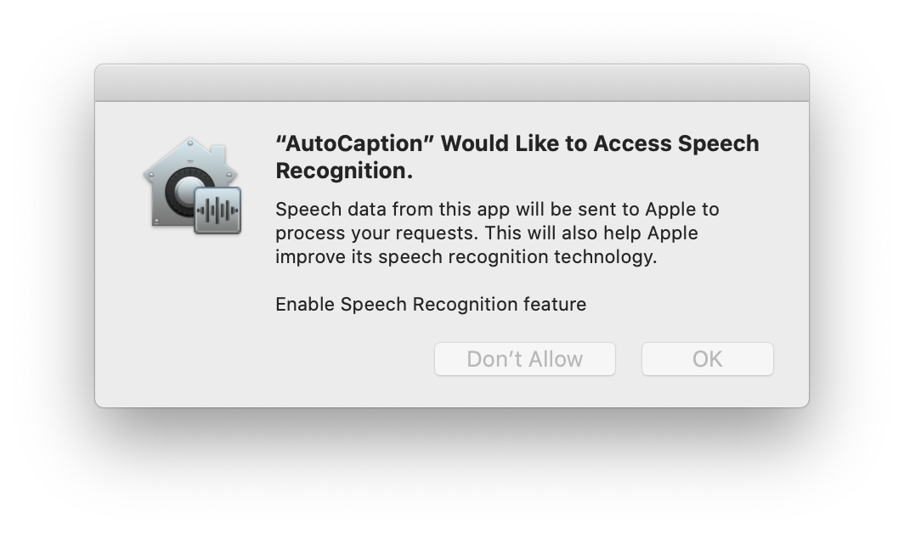
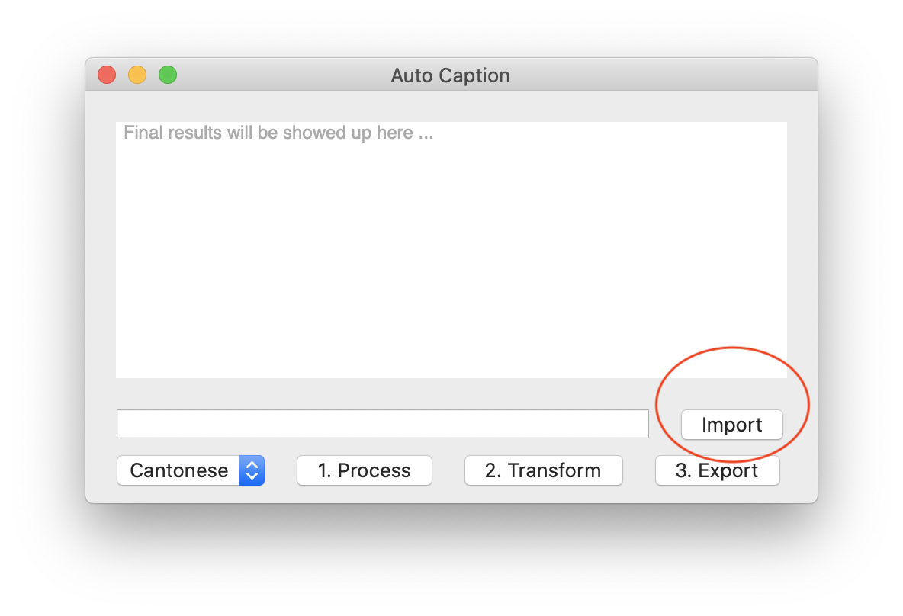
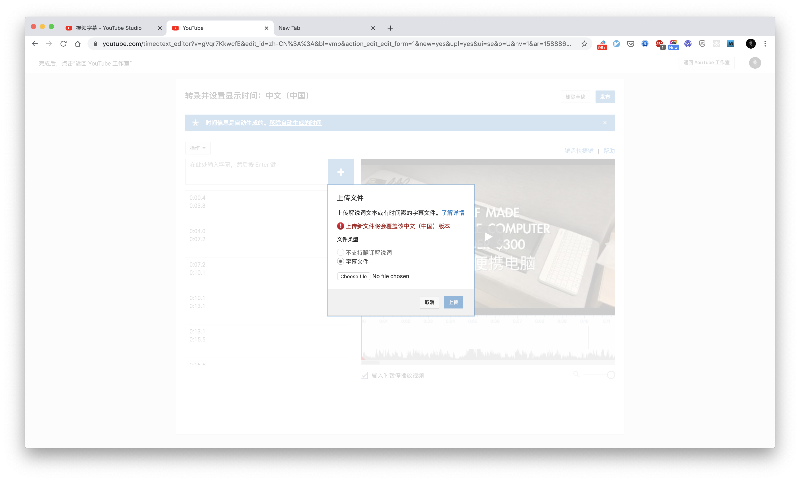

## Intro 介绍说明

Auto Caption 是一个能够自动将音频转换出 SRT 字幕文件的工具。这个工具跑再 macOS 系统上（抱歉对于 Windows 并不支持），它能够帮助你在本地完成字幕转换，意味着你不需要上传你的音频文件到第三方平台上。

它是基于 macOS 的 Speech Recognition 进行开发的，可能准确率并不是你想象中那么完美，但是它一定程度上能够提升你的工作效率。

现在它支持粤语，普通话还有英语。如果你想增加更多的语言支持，欢迎随时告诉我。

## How To Use - 如何使用

### Step 1 -  Installation - 安装

从这个指定的链接 https://github.com/lbj96347/auto-caption-mac/releases/download/v1.0.0/AutoCaption.app.zip

下载 AutoCaption 安装包，并且把它拖到「应用」文件夹中，就完成安装了。

打开应用时需要允许其在你的 mac 上面运行，可能会出现安全提示，可以通过以下步骤完成解锁：

系统偏好设置 > 安全和隐私 > 允许应用 AutoCaption 打开

打开 AutoCaption App 的时候，请允许 Speech Recognition 授权。

### Step 2 - Import valid audio sources - 导入音频资源

选择一个你需要转换到音频或者视频资源文件，目前 AutoCaption 支持 *.4a, *.mp4, *.mov 文件。**导入的音频或者是视频，建议是你创作的 YouTube 视频。**

导入这个文件到 AutoCaption 当中

### Step 3 -  Process it & Transform it into a SRT file - 识别转换字幕

首先按 `1. 预处理` 按钮对音频文件进行预处理。如果发生了错误，你可以尝试添加其他文件进行尝试。在你处理文件前，请尝试使用 QuckTime 软件对文件进行播放，看是否能够成功播放。

当 `预处理` 按钮变成 `处理完成` 的时候，意味着 Auto Caption 已经准备就绪，可以开始对音频资源进行字幕转换了。这个时候按下 `2. 转换字幕`

  

根据实际音频的长度，可能需要好几分钟，如果 `2. 转换完成` 出现了，那么就代表转换完成了。在处理过程中，你也可以看到字幕不断地从文本框中冒出来。

当所有的字幕弹出来后，按下 `3. 导出文件 ` 就可以将 SRT 文件导出到「下载」文件夹当中了。

### Step 4 - Upload SRT file to YouTube and correct it - 上传 YouTube

可能转换出来的准确率不是完美的，过程中可能跟口音，噪音，背景音乐的干扰等有一定的关系。

最后，选择你的本地 SRT 文件并上传到指定的 YouTube 视频中。上传成功后将会自动和你的 YouTube 视频的轨迹吻合上。

最后，你可以使用 YouTube 的字幕编辑器去编辑你的字幕文件，并且修正里面错误的一些字词。至此，你的创作就完成啦！

此外，Compressor 等工具也支持 SRT 文件，你也可以自行尝试，欢迎分享经验！

## Roadmap - 规划路线

1.0.0 Basic features - 基本功能

1.1.0 Improve workflow & UI - 流程改进或者体验优化

1.2.0 Supports more languages - 支持更多的语言

more .. 

## Donate - 捐赠

如果你喜欢这个工具，或者认为这个工具有帮助到你，欢迎随时向我发起捐赠或者红包！以支持我把这个小工具做得更好！非常感谢你的支持！

Paypal: https://paypal.me/cashlee96347

Alipay: 

