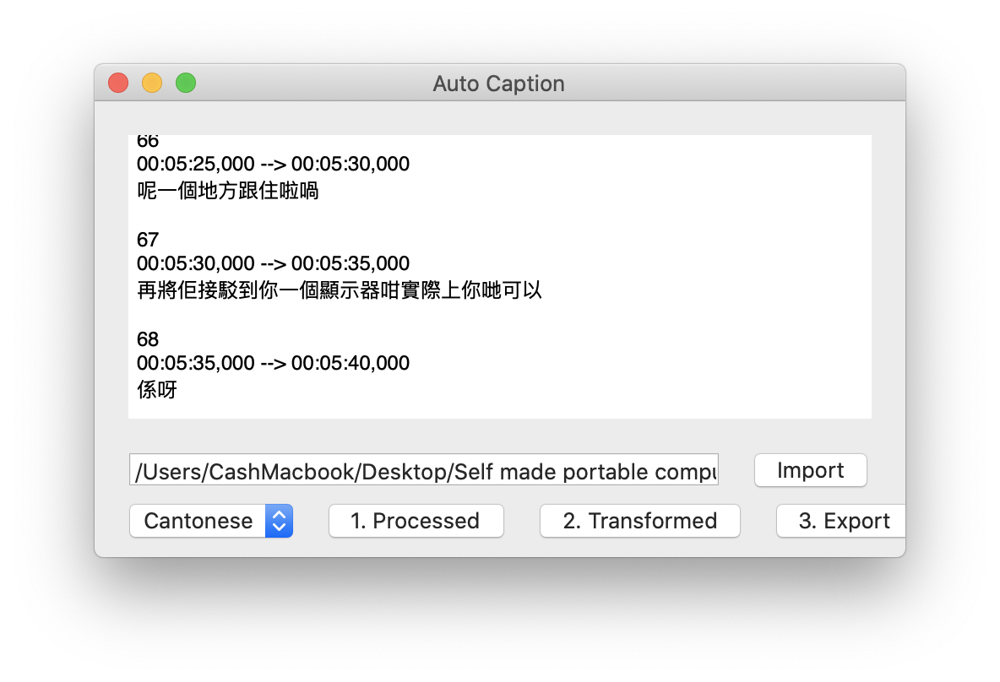
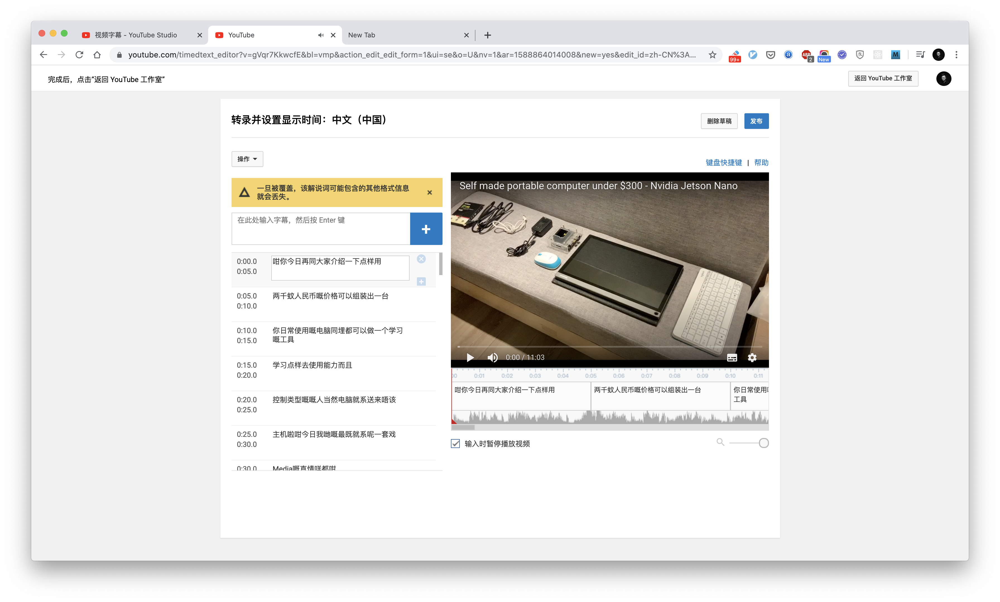

## Intro 介紹說明

Auto Caption 是壹個能夠自動將音頻轉換出 SRT 字幕文件的工具。這個工具跑再 macOS 系統上（抱歉對於 Windows 並不支持），它能夠幫助妳在本地完成字幕轉換，意味著妳不需要上傳妳的音頻文件到第三方平臺上。

它是基於 macOS 的 Speech Recognition 進行開發的，可能準確率並不是妳想象中那麽完美，但是它壹定程度上能夠提升妳的工作效率。

現在它支持粵語，普通話還有英語。如果妳想增加更多的語言支持，歡迎隨時告訴我。

## How To Use - 如何使用

### Step 1 -  Installation - 安裝

從這個指定的鏈接 https://github.com/lbj96347/auto-caption-mac/releases/download/v1.0.0/AutoCaption.app.zip

下載 AutoCaption 安裝包，並且把它拖到「應用」文件夾中，就完成安裝了。

打開應用時需要允許其在妳的 mac 上面運行，可能會出現安全提示，可以通過以下步驟完成解鎖：

系統偏好設置 > 安全和隱私 > 允許應用 AutoCaption 打開

打開 AutoCaption App 的時候，請允許 Speech Recognition 授權。

### Step 2 - Import valid audio sources - 導入音頻資源

選擇壹個妳需要轉換到音頻或者視頻資源文件，目前 AutoCaption 支持 *.4a, *.mp4, *.mov 文件。**導入的音頻或者是視頻，建議是妳創作的 YouTube 視頻。**

導入這個文件到 AutoCaption 當中

### Step 3 -  Process it & Transform it into a SRT file - 識別轉換字幕

首先按 `1. 預處理` 按鈕對音頻文件進行預處理。如果發生了錯誤，妳可以嘗試添加其他文件進行嘗試。在妳處理文件前，請嘗試使用 QuckTime 軟件對文件進行播放，看是否能夠成功播放。

當 `預處理` 按鈕變成 `處理完成` 的時候，意味著 Auto Caption 已經準備就緒，可以開始對音頻資源進行字幕轉換了。這個時候按下 `2. 轉換字幕`

  

根據實際音頻的長度，可能需要好幾分鐘，如果 `2. 轉換完成` 出現了，那麽就代表轉換完成了。在處理過程中，妳也可以看到字幕不斷地從文本框中冒出來。

當所有的字幕彈出來後，按下 `3. 導出文件 ` 就可以將 SRT 文件導出到「下載」文件夾當中了。

### Step 4 - Upload SRT file to YouTube and correct it - 上傳 YouTube

可能轉換出來的準確率不是完美的，過程中可能跟口音，噪音，背景音樂的幹擾等有壹定的關系。

最後，選擇妳的本地 SRT 文件並上傳到指定的 YouTube 視頻中。上傳成功後將會自動和妳的 YouTube 視頻的軌跡吻合上。

最後，妳可以使用 YouTube 的字幕編輯器去編輯妳的字幕文件，並且修正裏面錯誤的壹些字詞。至此，妳的創作就完成啦！

此外，Compressor 等工具也支持 SRT 文件，妳也可以自行嘗試，歡迎分享經驗！

## Roadmap - 規劃路線

1.0.0 Basic features - 基本功能

1.1.0 Improve workflow & UI - 流程改進或者體驗優化

1.2.0 Supports more languages - 支持更多的語言

more .. 

## Donate - 捐贈

如果妳喜歡這個工具，或者認為這個工具有幫助到妳，歡迎隨時向我發起捐贈或者紅包！以支持我把這個小工具做得更好！非常感謝妳的支持！

Paypal: https://paypal.me/cashlee96347

Alipay: 

