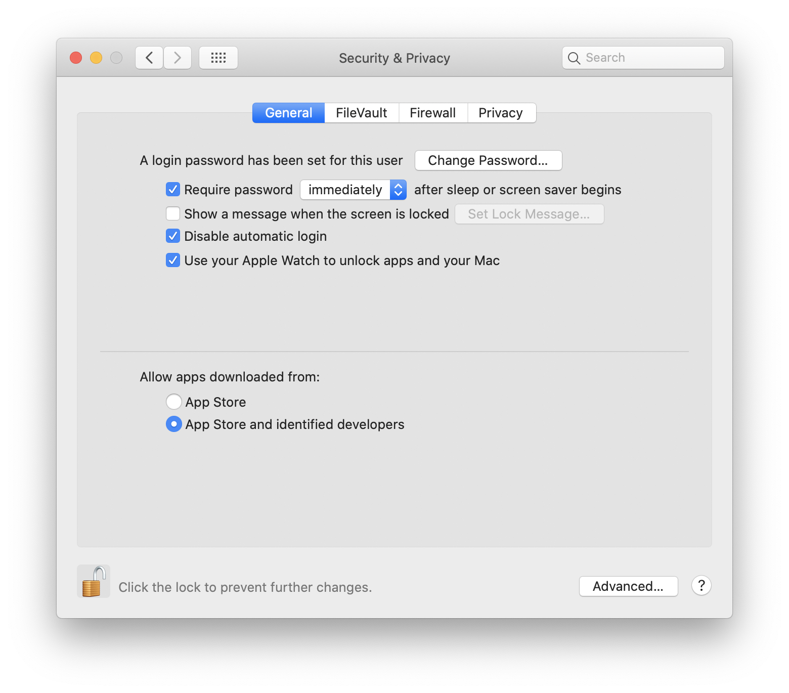
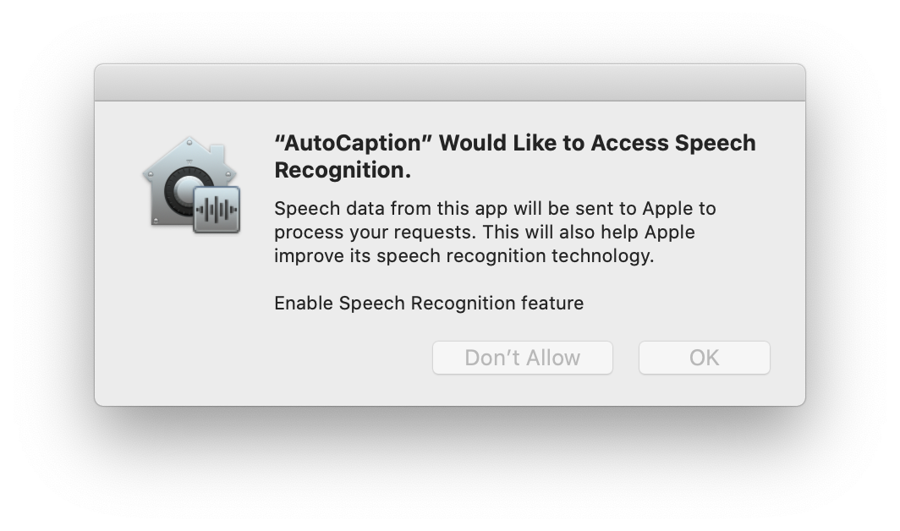
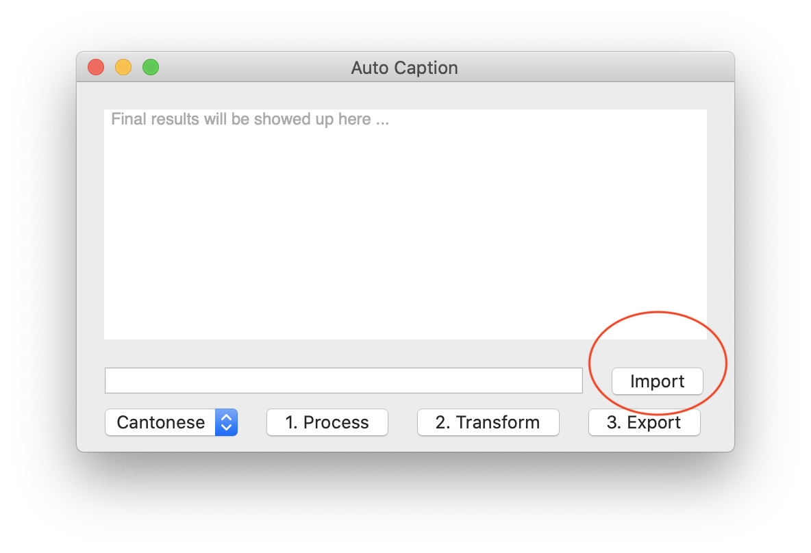
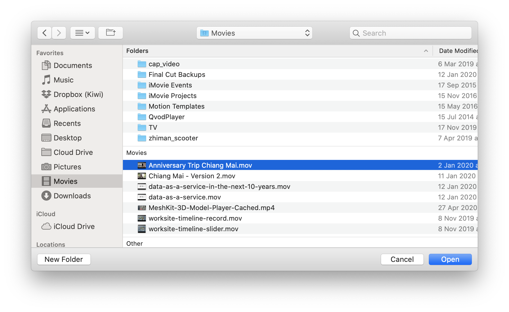
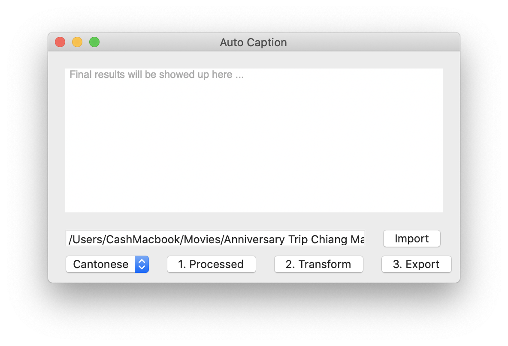
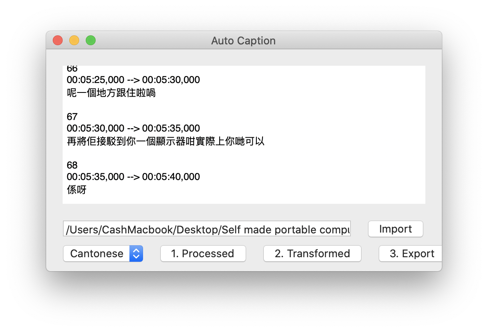
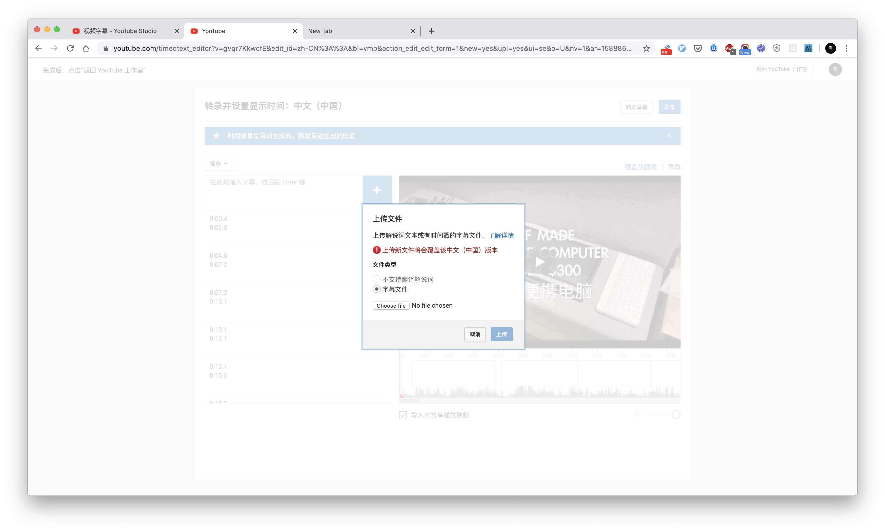
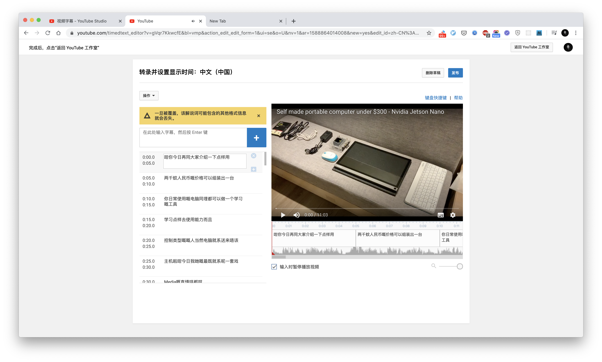

## Intro 

Auto Caption is tool can help creators to transform audio sources into SRT file automatically. It runs on macOS locally, that means you don't have to upload your audio sources to a third party platform. It bases on macOS speech recognition feature, maybe the accuracy is not perfect but it must help you to improve your efficiency. 

Now it supports Cantonese, Mandarin & English. If your wanna add more language support please feel free to talk with me.

## How To Use

### Step 1 -  Installation

Download AutoCaption from https://github.com/lbj96347/auto-caption-mac/releases/download/v1.0.0/AutoCaption.app.zip

Install lastest version: Drag & drop into Application folder 

Allow third party developer app runs on your Mac

Go System Preference > Security & Privacy > Allow apps downloaded from 

Open AutoCaption App & allow to access Speech Recognition 

### Step 2 - Import valid audio sources 

Pick up an audio / video file that you wanna extract. AutoCaption supports *.m4a, *.mp4, *mov files. **Just import the audio / video which you have already uploaded to YouTube. **

Import it into AutoCaption

### Step 3 -  Process it & Transform it into a SRT file

Press `1. Process` to process the audio file, if errors occurs, please try another file. Before you process the file, please try to play it by QuickTime and make sure it is a valid file. 

If `Process` button becomes `Processed`, it means Auto Caption is ready for transforming the audio sources. Now press `2. Transform`

  

Please wait for couple minutes till `2. Transformed` show up. During the progress you will see all caption pop up from the text field. 

After all caption showed up, just press `3. Export` to export SRT file. It will be stored in Downloads folder.

### Step 4 - Upload SRT file to YouTube and correct it

The accuracy of the transforming is not perfect, accent, noice background music etc may cause mistake. 

Select your local SRT file and upload it. When you upload your SRT file, it will be automatically match with your YouTube video.

Use YouTube Caption Editor to edit your caption and correct the error words. Your work is done. 

BTW Compressor tool also supports SRT file, you can try it on you Compressor by your own. 

## Roadmap 

1.0.0 Basic features

1.1.0 Improve workflow & UI 

1.2.0 Supports more languages 

more .. 

## Donate

Your donation could make this project more handy, powerful. It costs my days & nights to produce it. Thank you for your support. 

Paypal: https://paypal.me/cashlee96347

Alipay: 

